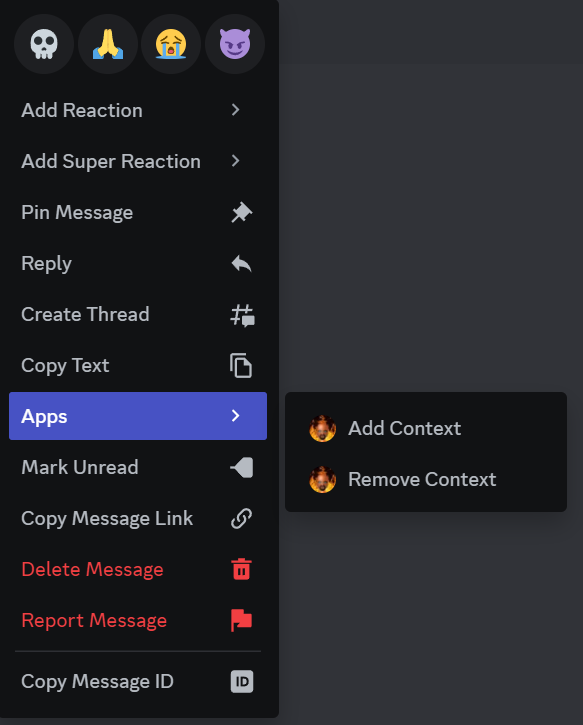

# WhereContextbot3

ELKE TITEL IS EEN COG DIE TELKENS HUN COMMANDS BESSCHRIJFT

## Muur

* /muur [naam]   toont een bepaalde quote

## Counter

* /ncount @user				toon het aantal nwords van een gegeven user
* /changencount @user amount	pas het aantal nwords van de gegeven user aan naar amount (admin only)

## General

* /help	Toon de lijst van alle actieve commands
* /lien		kick grom + lockdown alert (admin only)
* /ping	check de latency van de bot
* /say		laat de bot eender wat zeggen
* /embed	laat de bot eender wat zeggen, maar in een embed
* /countdown  countdown tot een gegeven moment

## Namen
Telkens met een parameter dat random kan zijn, of een specifiek bericht. 

* /gible		Stuurt een bericht over gible
* /nootje		Stuurt een bericht over nootje
* /pingy		Stuurt een bericht over pingy
* /ba			Stuurt een bericht over ba
* /meng		Stuurt een bericht over meng
* /broodman	Stuurt een bericht over broodman
* /keleo Stuur een bericht over keleo

## Out of Context

* /play	[True/False] Speel het out of context spel, true als andere mensen het spel ook mogen zien, anders false

  * previous		ga terug naar het vorige bericht
  * next			ga naar het volgende bericht
  * remove		verwijder het huidige bericht uit het spel
  * quit			stop met spelen
* Hoe toevoegen?

  

  Rechtermuisklik/lang drukken voor mobile **OP HET BERICHT** dat je wilt toevoegen -> apps -> Add Context
* Hoe verwijderen?	idem aan toevoegen/verwijderen terwijl je het spel aan het spelen bent

## Reacties

* /giblereact

  
* /wholesquadlaughing

  
* /notfunny

  
* /uthought

  

## Owner

Alles in deze cog is admin only

* /sync [Global/Server]	Synchronyseer de commands globaal/in server
* /load cog		Laad een bepaalde cog in
* /unload cog	Unload een bepaalde cog
* /reload cog	Reload een bepaalde cog
* /cogs		Toont een overzicht van alle cogs, ingeladen en niet ingeladen
* /restart		Herstart de bot, dit laadt ook alle cogs opnieuw in
* /blacklist show 	Toon een lijst van alle blackliste users. Blackliste users kunnen de bot helemaal niet gebruiken
* /blacklist add user		Voeg een gebruiker toe aan de blacklist
* /blacklist remove		Verwijder een gebruiker van de blacklist

## Stats
* /individuele_stats @user #command Hoeveel keer heeft iemand een command gebruikt
* /changecommandcount @usrer #command #count verander de count van user van command
* /leaderboard #command toont top 10 voor gegeven command